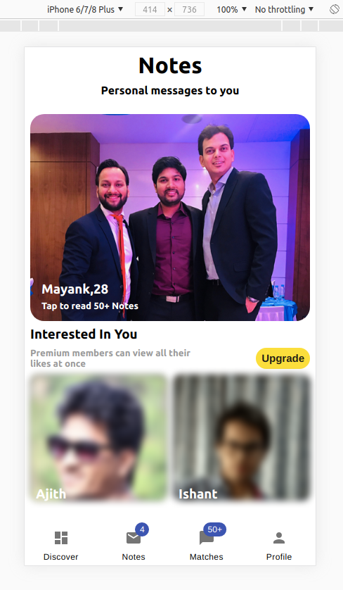

# This application Strictly Developed for Mobile View Only 

## What's this?

[Aisle Tech Challenge](https://www.aisle.co/)  UI of dating app. :blush:

### Screenshot




#
## How to ...

### ... run locally?

Make sure you have [Node](https://nodejs.org/en/) and [git](https://git-scm.com/) installed.

- Clone the repo:

  ```bash
  git clone https://github.com/sagarjsr/asile-tech-challenge.git
  cd aisle-tech-challenge
  ```

- Install the dependencies:

  ```bash
  npm install
  ```

- Fire up a development server:

  ```bash
  npm start
  ```

# aisle-tech-challenge